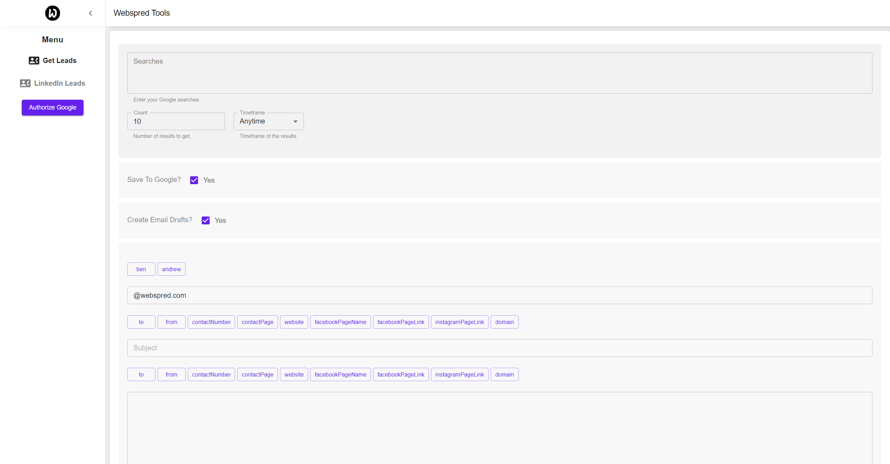
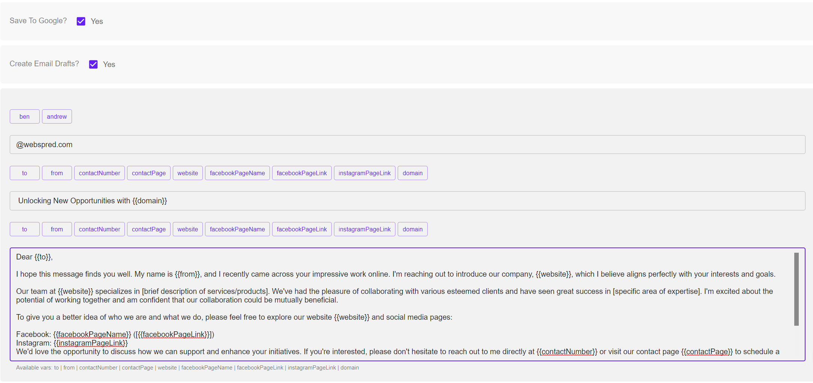

# App for Comprehensive Prospect Information Retrieval

This application is designed to facilitate the gathering of prospect information from Google searches. It is a practical tool for those who need to efficiently collect data for outreach or analysis purposes.

## Features

__Data Collection:__ The app can retrieve various types of prospect information, including:

- Phone numbers
- Email addresses
- Social media profiles and follower counts
- Contact pages
- Other pertinent prospect details

__Search Customization:__ Users can input specific queries (e.g., "Construction companies") and set filters based on the website's publication date (day, week, month, or anytime).

__Results Management:__ The search results can be organized and saved in a Google spreadsheet. This feature simplifies the process of data handling and review.

__Email Template Generation:__ An additional functionality of the app is to create email templates for outreach. These templates are customizable using variables collected during the data scraping process.

## Application Use

This tool is suitable for individuals or businesses looking to gather information about potential prospects for networking, marketing, or sales purposes. It simplifies the data collection process and assists in organizing outreach efforts.

# How To

1. Start cors-anywhere process:
`cd cors-anywhere && yarn start`
1. Start Electron process
`cd client && yarn electron`

## For Linked-In Searches

Ensure that `chromedriver` is downloaded and available in the PATH env var.
